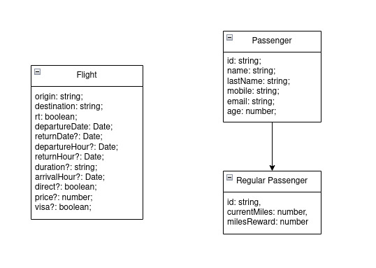

# JustFly

Aerolínea de bajo costo donde puedes comprar vuelos nacionales e internacionales.

## App

[Just-fly](https://just-fly-2506a66a617c.herokuapp.com/)

## Metodología de trabajo

## ¿Cómo funciona?

## Modelo de dominio

Hay tres entidades sobre Just-fly.

1. Vuelo
2. Pasajero
3. Pasajero frecuente

Pasajero tiene una relación directa con pasajero directa, donde se identifican por medio del id del pasajero.

Cada una de las propiedades corresponde a una funcionalidad dictada por negocio.

## Proceso de integración

Se usó la metodología de trabajo GitFlow.

## Despliegues

## Tecnologías

La aplicación es un proyecto realizado en Angular donde se desarrollaron componentes, modulos y servicios para el buen funcionamiento del sistema.

La aplicación usa s3, un servicio de AWS para el almacenamiento de datos, en este caso, para guardar imágenes.

El sistema usa Heroku para el despliegue de la aplicación y sirve para el host de este mismo.

Finalmente, se usa mocky para simular las respuestas de un API y poder presentarle al usuario datos de prueba.

